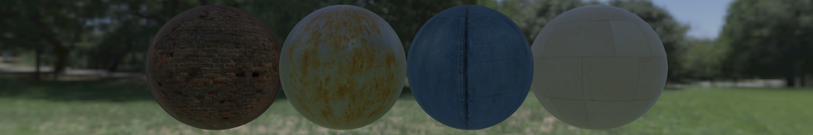

`pbr` is an implementation of a real-time Physically Based Rendering (PBR) pipeline based on the tutorials of 
[LearnOpenGL](https://learnopengl.com/). PBR materials consisting of an ambient occlusion map, a diffuse texture, a 
displacement map, a normal map, a roughness map, and optionally a specular map are supported. These textures are used to 
render meshes in a way grounded in physics, where all light comes from point lights. Meshes are normal mapped and 
displacement mapped, these effects can be seen in the image below. Image Based Lighting is implemented where the skybox 
is sampled to precompute diffuse and specular contributions from the rendering equation. In this way, not only the 
contributions of the point lights are counted but also of the environment. These effects can be seen in the images 
above.

#### Building
*   Clone [GLFW 3.3.2](https://github.com/glfw/glfw/releases/tag/3.3.2) into directory `external/glfw-3.3.1`.
*   Clone [glad v0.1.33](https://github.com/Dav1dde/glad/releases/tag/v0.1.33) into directory `external/glad-0.1.33`.
*   Clone [GLM 0.9.9.8](https://github.com/g-truc/glm/releases/tag/0.9.9.8) into directory `external/glm-0.9.9.8`.
*   Clone [stb](https://github.com/nothings/stb) into directory `external/stb`.
*   Build using CMake.

#### Controls
*   Drag MMB to orbit around the camera's focal point.
*   Drag RMB to move the camera's focal point in the XZ-plane.
*   Click on scene objects to bring up the translation widget.
*   Click on and drag with LMB on the translation widget to translate the scene object.
*   Scroll to change the distance of the camera to its focal point.
*   Press 1, 2, or 3 for an environment change.
*   Press F1 or F2 for a scene change.

#### Future improvements
*   Texture streaming: load higher quality textures on a separate thread.
*   Generate cubemap, irradiance cubemap, pre-filter cubemap, and BRDF LUT at compile time rather than run time.

#### Image credit
*   Material textures obtained from [TextureHaven](https://texturehaven.com/).
*   HDR textures obtained from [HDRIHaven](https://hdrihaven.com/).